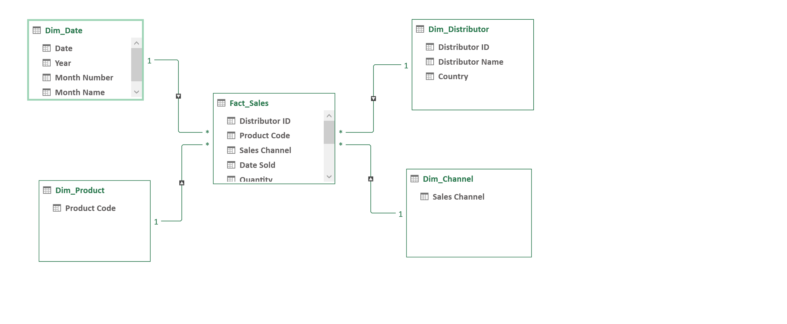

# Excel Data Modeling & Analysis Project

A structured Excel workbook demonstrating core data modeling, lookup, and analytical techniques applied to a global distributor sales dataset (FY 2012). The project covers data architecture, lookup formula design (VLOOKUP vs. INDEX-MATCH), PivotTable reporting, and scenario-aware data modeling.

---

## Table of Contents

- [Project Overview](#project-overview)
- [Dataset](#dataset)
- [Workbook Structure](#workbook-structure)
  - [Sheet 1 — Data](#sheet-1--data)
  - [Sheet 2 — VLookup](#sheet-2--vlookup)
  - [Sheet 3 — Index-Match](#sheet-3--index-match)
  - [Sheet 4 — Pivot Table](#sheet-4--pivot-table)
  - [Sheet 5 — Modeling](#sheet-5--modeling)
- [Key Techniques Demonstrated](#key-techniques-demonstrated)
- [Analytical Insights](#analytical-insights)
- [Skills & Tools](#skills--tools)

---

## Project Overview

This workbook simulates a real-world analyst workflow: starting from a raw transactional dataset, applying lookup logic to enrich records, building summary analytics through PivotTables, and finalizing a clean modeling layer. The exercises are structured as progressive problems (1a → 1b → 2a → 2b) that mirror the decision-making flow of a data or finance analyst.

---

## Dataset

| Attribute        | Detail                                      |
|-----------------|---------------------------------------------|
| **Records**      | 107 sales transactions                      |
| **Time Period**  | January – December 2012                     |
| **Geography**    | 50+ countries across 6 continents           |
| **Distributors** | ~115 unique distributor IDs (23265–23379)   |
| **Products**     | 11 SKUs across SUPA, DETA, and PURA lines   |
| **Channels**     | Online, Retail, Direct                      |
| **Revenue Range**| $30 – $3,016 per transaction                |
| **Total Revenue**| $81,938.61                                  |

### Data Schema

| Column           | Type     | Description                              |
|-----------------|----------|------------------------------------------|
| `Distributor ID` | Integer  | Unique distributor identifier            |
| `Distributor Name` | String | Full name of the distributor             |
| `Country`        | String   | Country of transaction                   |
| `Product Code`   | String   | SKU identifier (e.g., `SUPA105`)        |
| `Sales Channel`  | String   | Online / Retail / Direct                 |
| `Date Sold`      | DateTime | Full transaction date                    |
| `Month Sold`     | Integer  | Numeric month (1–12)                     |
| `Quantity`       | Integer  | Units sold                               |
| `Unit Price`     | Float    | Price per unit ($)                       |
| `Revenue`        | Float    | `Quantity × Unit Price`                  |

---

## Workbook Structure

### Sheet 1 — Data

The source-of-truth table containing all 107 raw transactions. This sheet serves as the lookup range for all formula exercises and the input layer for PivotTable analysis.

**Notable design choice:** The `Data` sheet also embeds inline problem statements and pre-solved INDEX-MATCH reference outputs in adjacent columns — functioning as both a raw data layer and a solution verification surface.

**Edge cases included in the dataset:**
- Non-existent Distributor IDs (e.g., `35000`, `40000`, `30000`) used intentionally in lookup exercises to test error-handling behavior (`#N/A` / `IFERROR` patterns).
- Decimal Distributor IDs (e.g., `23371.5`) to test approximate vs. exact match modes.

---

### Sheet 2 — VLookup

Structured as four progressive problems demonstrating VLOOKUP across increasing complexity:

| Problem | Lookup Key       | Return Value         | Challenge                                      |
|---------|-----------------|----------------------|------------------------------------------------|
| 1a      | Distributor ID  | Name                 | Basic exact-match, column index = 2            |
| 1b      | Distributor ID  | Sales Channel        | Cross-sheet reference, column index = 5        |
| 1c      | Distributor ID  | Channel, Qty, Revenue| Multi-column returns; includes invalid IDs     |
| 2a      | Distributor ID  | Name + Revenue       | Error handling with non-existent IDs           |
| 2b      | Distributor ID  | Unit Price           | Decimal ID edge case; average of results       |

**Key formula patterns:**
```excel
=VLOOKUP(lookup_value, Data!$A:$J, col_index, 0)
=IFERROR(VLOOKUP(...), "Not Found")
=AVERAGE(result_range)          -- aggregating VLOOKUP outputs
```

**Limitation demonstrated:** VLOOKUP's left-to-right column dependency — the lookup key must always be in the leftmost column of the array, making it brittle for reordered or updated schemas.

---

### Sheet 3 — Index-Match

Mirrors the exact same problem set as Sheet 2 but implemented with `INDEX`/`MATCH`, showcasing why it is the preferred pattern in production models.

| Problem | Lookup Key       | Return Value         | Advantage Over VLOOKUP                         |
|---------|-----------------|----------------------|------------------------------------------------|
| 1a      | Distributor ID  | Name                 | Column order independence                      |
| 1b      | Distributor ID  | Sales Channel        | No hardcoded column index                      |
| 1c      | Distributor ID  | Channel, Qty, Revenue| Robust to schema changes                       |
| 2a      | Distributor ID  | Name + Revenue       | Cleaner error-handling composition             |
| 2b      | Distributor ID  | Unit Price           | Handles non-integer IDs without approximate match risk |

**Key formula pattern:**
```excel
=INDEX(Data!$B:$B, MATCH(lookup_value, Data!$A:$A, 0))
=IFERROR(INDEX(..., MATCH(...)), "Not Found")
```

**Design advantage:** Unlike VLOOKUP, `INDEX`/`MATCH` decouples the return column from its position, enabling stable formulas even when columns are inserted, deleted, or reordered.

---

### Sheet 4 — Pivot Table

Contains six PivotTable summaries providing multi-dimensional views of the sales data:

| Pivot Table              | Row Dimension       | Value Metric(s)                  | Insight                                     |
|--------------------------|--------------------|------------------------------------|---------------------------------------------|
| Sales by Channel         | Sales Channel      | Total Revenue                     | Online leads at $37,197 (45% of total)      |
| Sales by Month           | Month Name         | Total Revenue                     | August is peak month ($33,327 / 41%)        |
| Monthly Quantity & Rev   | Month Name         | Total Quantity + Total Revenue    | June–August account for ~83% of volume      |
| Monthly Average Price    | Month Name         | Average Unit Price                | January has highest avg price ($9.43)       |
| Top Distributors         | Distributor Name   | Total Revenue                     | Top 20 distributors = 47% of revenue        |
| Revenue by Country       | Country            | Total Revenue                     | France is #1 market ($3,016)                |
| Revenue by Product Code  | Product Code       | Total Revenue                     | SUPA105 dominates at $20,938 (26%)          |

---

### Sheet 5 — Modeling


*Star schema model: Fact_Sales connected to Dim_Date, Dim_Distributor, Dim_Product, and Dim_Channel*

A clean, structured replica of the source data used as the foundation for further modeling work. This sheet:

- Preserves all 107 records with full schema integrity
- Acts as a dedicated modeling layer, isolated from the raw `Data` sheet to support scenario analysis, calculated columns, and downstream formula work without polluting the source
- Enables forward extension: adding projected revenue columns, applying discount tiers, or building a sensitivity table on top of clean transactional data

---

## Key Techniques Demonstrated

| Technique                  | Sheet(s)              | Description                                                                 |
|---------------------------|-----------------------|-----------------------------------------------------------------------------|
| **VLOOKUP**               | VLookup               | Exact-match lookups across sheets; multi-column retrieval                   |
| **INDEX / MATCH**         | Index-Match           | Position-independent lookups; preferred for production use                  |
| **IFERROR**               | VLookup, Index-Match  | Graceful handling of missing/invalid IDs                                    |
| **PivotTables**           | Pivot Table           | Aggregation by channel, month, distributor, country, and product            |
| **Cross-sheet References**| VLookup, Index-Match  | `Data!$A:$J` range references maintaining single source of truth            |
| **Calculated Fields**     | Data, Modeling        | `Revenue = Quantity × Unit Price`                                           |
| **Error Edge Cases**      | VLookup, Index-Match  | Intentional invalid IDs and decimal IDs to validate formula robustness      |
| **Data Aggregation**      | Pivot Table           | `AVERAGE` and `SUM` across filtered subsets                                 |

---

## Analytical Insights

From the PivotTable analysis, several patterns stand out:

- **Seasonality:** August alone accounts for 41% of annual revenue ($33,327), with June–August collectively representing ~83% of total revenue. This strong seasonal concentration suggests a Q3-heavy demand cycle.
- **Channel Mix:** Online ($37,197) and Retail ($34,385) are nearly equal contributors, together representing 87% of revenue. Direct channel ($10,356) serves a smaller but distinct distributor segment.
- **Product Concentration:** The SUPA product line (SUPA105, SUPA104, SUPA103, SUPA102) generates ~49% of total revenue, with SUPA105 alone at 26% — indicating a flagship SKU dependency.
- **Geographic Spread:** Revenue is distributed across 50+ countries, but the top 20 countries represent a significant share, suggesting opportunities for geographic prioritization in sales strategy.
- **Pricing:** Average unit prices range from $3.00 (PURA100) to $14.50 (SUPA105), with January showing the highest monthly average price — likely driven by the product mix sold in that period.

---

## Skills & Tools

**Excel Functions:** `VLOOKUP` · `INDEX` · `MATCH` · `IFERROR` · `AVERAGE` · `SUM`

**Excel Features:** PivotTables · Cross-sheet references · Named ranges · Data sorting & filtering

**Concepts:** Lookup formula design patterns · Error handling · Data normalization · Dimensional analysis · Aggregation and summarization · Data modeling layer separation
